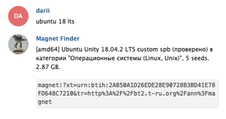

# tlg_playground
**tlg_playground** is a small project for a telegram bot. The primary goal of its creation was a need to refresh my knowledge of TypeScript. Secondly, it serves fresh .magnet links over Telegram. Please use it on your own risk and also please don't neglect the copyright law. Running this bot may be illegal in certain countries.

## How It Works


## Getting Started
Create an `.env` file in the root of this project with the following info:

```$sh
TOKEN=<your telegram token>
RT_LOGIN=<your torrent tracker login>
RT_PASSW=<your torrent tracker password>
LOG_LEVEL=3
```

For Telegram API key, check https://github.com/Finalgalaxy/telegram-telegraf-bot and follow README instructions about how to create a Telegram Bot.

## Dependencies
- [Telegraf](https://telegraf.js.org)
- [thepiratebay](https://github.com/t3chnoboy/thepiratebay) 
- [RutrackerApi](https://github.com/nikityy/rutracker-api) (optional)


